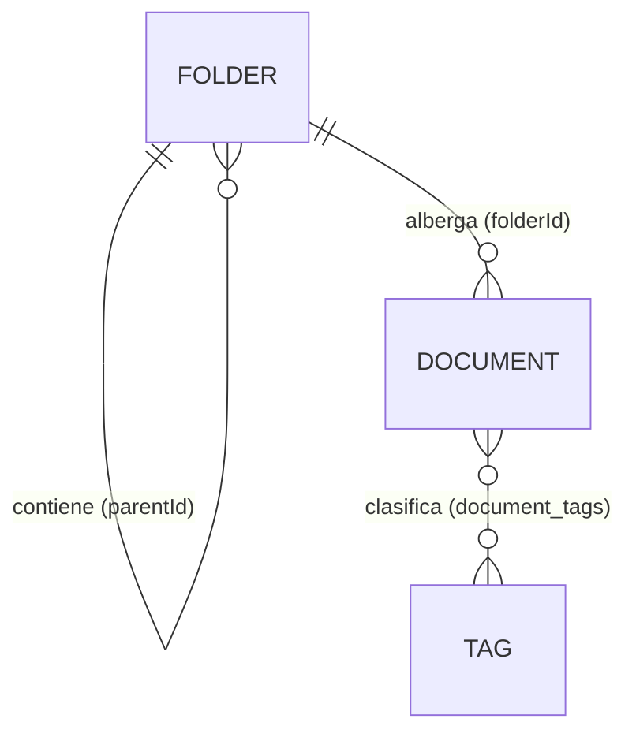

# Modelo documental y arquitectura de la información

Cómo TechDocs **organiza la documentación** para que sea escalable y fácil de ordenar.
Define el modelo de dominio, la navegación **jerárquica de carpetas**, las interacciones, los contratos de
servicio, el esquema de datos y la estrategia para operar a gran escala.

Es **transversal a los módulos**: M1 implementa la versión *mock* (en memoria); M2 lo lleva a API +
PostgreSQL; M3 añade seguridad. La **interfaz de los servicios se diseña hoy** pensando en ese
salto, de modo que pasar de mock a API **no toque los componentes**.

> Convenciones de código en [`../CONVENTIONS.md`](../CONVENTIONS.md) · Proceso en [`../../AGENTS.md`](../../AGENTS.md).

---

## 1. Principio rector

> **Una jerarquía para ordenar + etiquetas para clasificar.**

- Cada documento tiene **un único hogar** (su carpeta) → orden y una sola fuente de verdad.
- Cada documento tiene **N etiquetas** transversales que lo cruzan sin romper la jerarquía.

Es el equilibrio entre el "árbol de archivos" (ordenado pero rígido) y "todo con tags" (flexible
pero caótico). La **carpeta** responde *¿dónde vive?*; el **tag**, *¿de qué trata?*.

---

## 2. Modelo de dominio

```
Biblioteca  →  Carpetas (árbol)  →  Documentos  ──(N:M)──  Tags
```



### 2.1 Entidades

**`Folder`** — nodo del árbol de organización.

| Campo | Tipo | Notas |
|-------|------|-------|
| `id` | `string` | Identificador estable (uuid/slug). |
| `name` | `string` | Nombre visible. |
| `parentId` | `string \| null` | `null` ⇒ carpeta raíz. La auto-referencia forma el árbol. |
| `createdAt` | `string` (ISO) | Auditoría. |
| `docCount` *(derivado)* | `number` | Conteo de documentos (denormalizado a escala). |

**`Document`** — unidad de documentación.

| Campo | Tipo | Notas |
|-------|------|-------|
| `id` | `string` | Identificador estable. |
| `name` | `string` | Título visible. |
| `folderId` | `string` | **Hogar** (obligatorio). FK a `Folder`. |
| `type` | `'pdf' \| 'docx' \| 'md' \| 'xlsx' \| 'img'` | Derivado de la extensión al subir. |
| `status` | `'draft' \| 'review' \| 'published' \| 'archived'` | Flujo editorial. |
| `author` | `string` | Autor (en M3 pasa a `userId`). |
| `tags` | `string[]` | Clasificación transversal (en M2 se normaliza a `Tag[]`). |
| `uploadedAt` | `string` (ISO) | Fecha de carga. |
| `updatedAt` | `string` (ISO) | Última modificación. |
| `size` | `number` | Bytes del archivo (0 si aún es solo metadata). |
| `source` | `{ kind: 'file' \| 'content'; ref?: string; content?: string }` | Archivo subido **o** contenido escrito. |
| `description?` | `string` | Resumen opcional. |

**`Tag`** — etiqueta global de la biblioteca.

| Campo | Tipo | Notas |
|-------|------|-------|
| `id` | `string` | Identificador. |
| `name` | `string` | Único, normalizado (minúsculas, sin duplicar). |

### 2.2 Relaciones

| Relación | Cardinalidad | Implementación |
|----------|:------------:|----------------|
| Carpeta → Subcarpetas | 1 : N | `folders.parentId` |
| Carpeta → Documentos | 1 : N | `documents.folderId` |
| Documento ↔ Tags | N : M | join `document_tags` |

### 2.3 Las dos dimensiones (no compiten)

| | **Carpeta** | **Tag** |
|--|-------------|---------|
| Responde a | *¿Dónde vive?* | *¿De qué trata?* |
| Cardinalidad | **1** (un hogar) | **N** (varias) |
| Forma | Jerárquica (árbol) | Plana |
| En BD | `documents.folderId` | join `document_tags` |

> **Por qué 1 carpeta y no multi-parent:** un documento "en varias carpetas" hace ambigua su ruta
> canónica y complica UI, BD, breadcrumbs y permisos. La necesidad de "que aparezca en varios
> sitios" la cubren los **tags** y la búsqueda.

---

## 3. Navegación — por carpetas (híbrido agrupado)

TechDocs adopta un patrón de **explorador de archivos**: un **árbol en el sidebar** para saltar/crear, y un
**panel central que también navega**, mostrando el contenido de la carpeta actual agrupado en
**Carpetas** (subcarpetas) y **Documentos**.

```
┌───────────────┬───────────────────────────────────────────────┐
│  ÁRBOL         │  Biblioteca / Documentación / API   [▤ ▦] [＋] │ ← breadcrumb + toolbar
│  ▾ Document.   │  🔍 buscar   [Estado ▾] [Tipo ▾] [Tag ▾]        │ ← filtros
│    ▾ API   ◀   │  ── Carpetas ─────────────────────────────────│
│      ▸ v1      │   📁 v1        📁 v2        📁 Borradores        │ ← subcarpetas (navegables)
│      ▸ v2      │  ── Documentos ───────────────────────────────│
│    ▸ Guías     │   [ tabla ó cuadrícula de documentos ]          │ ← vista lista/folder
│  ▸ Finanzas    │                                                 │
│  ＋ Carpeta     │                          ‹ 1 2 3 ›             │ ← paginador
└───────────────┴───────────────────────────────────────────────┘
```

### 3.1 Zonas de la pantalla

| Zona | Contenido | Rol |
|------|-----------|-----|
| **Sidebar (árbol)** | Carpetas anidadas + "＋ Nueva carpeta" | Navegación global y creación de estructura |
| **Breadcrumb** | Ruta desde *Biblioteca* hasta la carpeta actual | Subir a cualquier ancestro con un clic |
| **Toolbar** | Búsqueda · filtros (estado/tipo/tag) · toggle vista · ＋Nuevo | Acciones sobre la carpeta actual |
| **Sección Carpetas** | Subcarpetas de la carpeta actual (tarjetas/filas) | Entrar a subcarpetas desde el panel |
| **Sección Documentos** | Tabla (lista) o cuadrícula (folder) | Ver/trabajar los documentos |
| **Paginador** | Rango + páginas | Paginar los documentos |

> Las **carpetas** no tienen estado/tipo/fechas de documento; por eso van en **su propia sección**
> y no se mezclan en las columnas de la tabla. Así la tabla de documentos se mantiene limpia y
> significativa, conservando a la vez la navegación por carpetas en el panel.

### 3.2 Modos de vista (presentación)

`viewMode: 'list' | 'grid'`, **persistido en localStorage** (como el tema). Cambia el *cómo se ve*,
no el *qué*: opera sobre los mismos documentos filtrados/paginados.

> **Estado:** M1 implementa solo la **vista Lista** (`DataTable`). La vista **Folder** (cuadrícula
> con `DocumentCard`) y el toggle persistido quedan para **M5**.

| Modo | Carpetas | Documentos |
|------|----------|------------|
| **Lista** (`▤`) | Filas compactas con icono + nombre + nº de items | `DataTable` con metadata (estado, tipo, fechas) |
| **Folder** (`▦`) | Tarjetas de carpeta | `DocumentCard` en cuadrícula (icono, nombre, tags, estado) |

---

## 4. Interacciones (paso a paso)

### 4.1 Navegar
- **Clic en una carpeta** (árbol o sección Carpetas) ⇒ *entrar*: cambia `selectedFolderId`,
  se actualizan breadcrumb, título y contenido.
- **Clic en el breadcrumb** ⇒ saltar a un ancestro.
- **Toggle del árbol** (`▸/▾`) ⇒ expandir/colapsar sin cambiar de carpeta.

### 4.2 Crear carpeta / subcarpeta
1. "＋ Nueva carpeta" (raíz del árbol) o ＋ dentro de una carpeta (subcarpeta).
2. Aparece un **input inline**; el usuario escribe el nombre.
3. **Enter** confirma (`addFolder(parentId, name)`), **Esc** cancela.
4. La nueva carpeta aparece en el árbol y en la sección Carpetas.

### 4.3 Crear / subir documento
1. "＋ Nuevo" › *Subir documento* (estando dentro de la carpeta destino).
2. Form (Reactive Forms): nombre, tipo *(derivado en M2 del archivo)*, **tags** (chips), descripción.
3. Al guardar (`create(input)`), el documento nace con `folderId` = carpeta actual,
   `status='draft'`, `uploadedAt=now`, `author=usuario`.
4. Aparece en la sección Documentos.

> En **M1** se crea **metadata** (sin binario). En **M2** el form acepta el archivo real
> (`source.kind='file'`), deriva `type`/`size` y lo persiste.

### 4.4 Mover, renombrar, eliminar
- **Mover** documento: acción "Mover a…" abre un selector de carpeta (mini-árbol) → `move(id, folderId)`.
  *(Drag & drop queda para una iteración futura.)*
- **Renombrar / eliminar**: acciones por fila/tarjeta y por nodo del árbol.
- **Eliminar carpeta no vacía**: en M1 se **bloquea** (pide vaciarla); el borrado en cascada se
  decide en M2 con backend (papelera/soft-delete).

---

## 5. Ciclo de vida del documento

```
crear (metadata) → Borrador → En revisión → Publicado → Archivado
```

| Estatus | Significado | Badge |
|---------|-------------|:-----:|
| `draft` | Borrador en edición | 🔵 |
| `review` | En revisión | 🟡 |
| `published` | Publicado/vigente | 🟢 |
| `archived` | Archivado (histórico) | ⚪ |

La metadata se **deriva** al crear: `type` ← extensión, `size` ← archivo, `uploadedAt` ← ahora,
`author` ← usuario, `status` ← *Borrador*. El usuario aporta **nombre + tags (+ descripción)**.

---

## 6. Tags

- **Asignación:** al crear/editar, mediante input de **chips** (escribir + Enter).
- **Uso:** filtro por tag en la toolbar y búsqueda; se muestran como chips en card/detalle.
- **Normalización:** minúsculas, sin duplicar; en M2, tabla `tags` + join `document_tags`.
- **Autocompletado:** a escala, sugerir tags existentes (nube global) para evitar variantes
  (`api`, `API`, `apis`).

---

## 7. Estrategia para gran escala

Reglas para aguantar miles de documentos y árboles profundos sin degradar la UX.

| Técnica | Qué | Por qué |
|--------|-----|---------|
| **Carga perezosa** | Árbol por niveles (hijos al expandir); documentos por carpeta | No traer toda la biblioteca de golpe |
| **Paginación keyset** | Cursor (`WHERE id > :last LIMIT n`) en vez de `OFFSET` | `OFFSET` se degrada en páginas altas; keyset es estable por índice |
| **Filtro/orden en servidor** | Estado/tipo/tag/orden los resuelve la API | El cliente nunca descarga el set completo para filtrar |
| **Búsqueda full-text** | `tsvector` (PostgreSQL) o motor dedicado (Meilisearch) + tags indexados | Buscar por nombre/contenido/tag a escala |
| **Árbol en BD** | *Adjacency list* (`parentId`) por defecto; *materialized path* / *recursive CTE* para subárboles | Mover una carpeta = actualizar un prefijo de ruta, no recorrer N filas |
| **Conteos denormalizados** | `docCount` por carpeta, mantenido por trigger/evento | Evitar `COUNT(*)` en cada render |
| **Caché en cliente** | `FolderService` cachea subárboles ya cargados (signals) | Navegación instantánea sin re-fetch |
| **IDs/slugs estables** | Carpeta y documento con id en la URL | Enlaces compartibles + breadcrumb fiable |
| **Virtualización** | (futuro) listas/árboles virtualizados (CDK) | Render fluido con miles de filas |

> **M1** resuelve filtro/paginación **en cliente** sobre datos mock — válido para validar UX. La
> frontera a *servidor* se cruza en **M2**, **sin cambiar los componentes** (mismos contratos).

---

## 8. Mapeo al frontend (Angular v22)

### 8.1 Servicios (estado con signals)

| Servicio | Responsabilidad | Estado |
|----------|-----------------|:---:|
| `FolderService` | Árbol, `selectedFolderId`, navegación, alta/borrado, expansión, color por carpeta | ✅ M1 |
| `DocumentService` | Documentos (mock), filtrar, crear/actualizar/mover/eliminar | ✅ M1 |
| `DocumentFilterService` | Criterios de búsqueda y filtros (término, estado, tipo) compartidos | ✅ M1 |
| `ViewModeService` *(o signal local)* | `'list' \| 'grid'` persistido en localStorage | ⬜ M5 (hoy solo lista) |

### 8.2 Componentes

| Componente | Tipo | Rol | Estado |
|-----------|------|-----|:---:|
| `FolderTree` / `FolderNode` | recursivo (sidebar) | Árbol navegable desde "Inicio" + crear/eliminar + expandir todo | ✅ M1 |
| `Breadcrumb` | dumb | Encabezado del panel: ruta de carpetas (retroceso) + título del nivel | ✅ M1 |
| Buscador (header) + `DocumentFilters` | dumb | Búsqueda + **popover** de filtros (estado/tipo) · ＋Nuevo vía FAB | ✅ M1 |
| `FolderCards` | dumb | Sección "Directorios" (subcarpetas en carrusel) | ✅ M1 |
| `DataTable` *(shared)* | dumb genérico | Vista **lista** (reutilizable, con `appCellFor`) | ✅ M1 |
| `Paginator` *(shared)* | dumb | Paginación | ✅ M1 |
| `NewDocumentForm` | smart | Subir documento (dropzone → metadata; Reactive en M2) | ✅ M1 |
| `EditDocumentForm` · `DocumentDetail` | smart/dumb | Editar (ligero) y ver (solo lectura) en modal | ✅ M1 |
| `Modal` · `ConfirmDialog` *(shared)* | dumb | Shell de modal reutilizable · confirmación de borrado | ✅ M1 |
| `StatusBadge` | dumb | Punto de estado palpitante con tooltip | ✅ M1 |
| `DocumentGrid` / `DocumentCard` | dumb | Vista **folder** (cuadrícula) | ⬜ M5 |
| `MovePicker` | dumb | Selector de carpeta destino para "Mover a…" | ⬜ M2 |

> **Nota:** el breadcrumb dejó de derivarse de `PageHeaderService` (que sigue sirviendo a rutas
> estáticas como Configuración) y pasó a ser el componente `Breadcrumb` del panel, alimentado por
> `FolderService`. La "toolbar" se repartió: **buscador en el header** + **filtros en popover**.

### 8.3 Flujo reactivo

```
selectedFolderId ─┐
search/filters ───┼─▶ computed(documentosVisibles) ─▶ paged ─▶ [lista | grid]
page/pageSize ────┘
                  └─▶ computed(subcarpetas) ─▶ sección Carpetas
viewMode ─────────────────────────────────────▶ elige render
```

Todo con **signals**: ningún `BehaviorSubject` para estado de UI (ver `CONVENTIONS.md` §4).

---

## 9. Contratos de servicio (mock → API)

La firma es **estable**; M1 devuelve valores síncronos (signals), M2 devuelve asíncronos
(`Observable`/`Promise`) con la **misma forma**.

```ts
// M1 (mock, síncrono con signals)
interface FolderService {
  readonly folders: Signal<Folder[]>;          // árbol (o lista plana + computed)
  readonly selectedFolderId: Signal<string | null>;
  children(parentId: string | null): Folder[]; // subcarpetas directas
  path(folderId: string): Folder[];            // breadcrumb (raíz → actual)
  select(folderId: string | null): void;
  addFolder(parentId: string | null, name: string): void;
  rename(id: string, name: string): void;      // futuro
  remove(id: string): void;                    // bloquea si no está vacía (M1)
}

interface DocumentService {
  readonly documents: Signal<Document[]>;       // de la carpeta activa (M1: todos en memoria)
  create(input: NewDocument): void;             // folderId = carpeta actual
  move(id: string, folderId: string): void;
  remove(id: string): void;
}
```

> En **M2**, `children()` / `documents` se alimentan de la API (paginados/keyset) y los métodos de
> mutación devuelven el resultado de la operación. Los **componentes no cambian**.

---

## 10. Esquema de datos (PostgreSQL · M2)

```sql
folders (
  id          uuid primary key,
  name        text not null,
  parent_id   uuid references folders(id),     -- null = raíz
  path        ltree,                            -- materialized path (subárboles)
  created_at  timestamptz default now()
);
create index on folders (parent_id);
create index on folders using gist (path);

documents (
  id          uuid primary key,
  name        text not null,
  folder_id   uuid not null references folders(id),
  type        text not null,
  status      text not null default 'draft',
  author_id   uuid,
  size        bigint default 0,
  source_kind text not null default 'content', -- 'file' | 'content'
  source_ref  text,                             -- ruta/clave del binario
  search_tsv  tsvector,                         -- full-text (nombre + contenido)
  created_at  timestamptz default now(),
  updated_at  timestamptz default now()
);
create index on documents (folder_id);
create index on documents using gin (search_tsv);

tags (id uuid primary key, name text unique not null);
document_tags (
  document_id uuid references documents(id),
  tag_id      uuid references tags(id),
  primary key (document_id, tag_id)
);
```

---

## 11. Rutas / URLs

| Ruta | Vista |
|------|-------|
| `/dashboard` | Redirige a la carpeta raíz (Biblioteca) |
| `/dashboard/folders/:folderId` | Contenido de la carpeta |
| `/dashboard/documents/:id` | Detalle del documento *(M2)* |
| `/dashboard/settings` | Configuración (temas) |

Filtros y vista como **query params** para que el estado sea compartible:
`?q=…&status=…&type=…&tag=…&view=grid&page=2`.

> **M1:** `selectedFolderId` puede vivir en signal (sin rutas de carpeta); el ruteo por
> `:folderId` y los query params se formalizan en **M2**.

---

## 12. Estados vacíos y casos borde

| Caso | Comportamiento |
|------|----------------|
| Carpeta sin subcarpetas ni documentos | Empty state "Carpeta vacía" + CTA crear/subir |
| Filtros sin coincidencias | Mensaje "Ningún documento coincide…" en la sección Documentos |
| Carpeta raíz | Breadcrumb = solo "Biblioteca"; sin botón "subir nivel" |
| Eliminar carpeta no vacía | Bloqueado en M1 (pide vaciar); soft-delete/papelera en M2 |
| Eliminar último doc de una página | Retroceder a la última página válida |
| Nombres duplicados en una carpeta | Permitidos (id es la identidad); aviso opcional |

---

## 13. Accesibilidad (WCAG)

- Árbol con roles `tree`/`treeitem`, `aria-expanded`, navegación por teclado (↑↓→←).
- Breadcrumb como `nav` + `aria-current="page"` en el último.
- Toggle de vista y acciones con `aria-label`; foco visible.
- Tabla con `<th scope>`; tarjetas como elementos enfocables.

---

## 14. Alcance por módulo

| Capacidad | M1 (mock) | M2 (API + Postgres) | M3 (seguridad) |
|----------|:---------:|:-------------------:|:--------------:|
| Árbol de carpetas (crear, navegar, eliminar) | ✅ | persistido | — |
| Navegación por carpetas (Directorios + Documentos) | ✅ | servidor | — |
| Vista **lista** + filtros (estado/tipo) + paginación | ✅ (cliente) | servidor (keyset) | — |
| Vista **folder** (cuadrícula `DocumentCard`) | — (M5) | — | — |
| Tags (asignar al subir/editar, mostrar) | ✅ | normalizado + índice + filtro por tag | — |
| Crear documento (metadata, dropzone) | ✅ | persistido | — |
| Editar (metadata) / eliminar (con confirmación) | ✅ | ✅ | — |
| Subir/descargar binario real | — | ✅ | tipos/tamaño/sanitización |
| Mover (acción "Mover a…") | ◑ (servicio) | ✅ (UI) | — |
| Drag & drop, miniaturas, virtualización | — | ◑ | — |
| Búsqueda full-text | — | ✅ | — |
| Permisos por carpeta (ACL, herencia) | — | — | ✅ |
| Papelera / soft-delete / versiones | — | ◑ | ✅ |

Leyenda: ✅ incluido · ◑ parcial/opcional · — fuera de alcance.

---

## 15. Decisiones registradas (ADR-lite)

1. **Navegación por carpetas (híbrido agrupado)** — sidebar = árbol; panel = *Carpetas* +
   *Documentos*. *Consecuencia:* el panel maneja dos tipos, resuelto con secciones separadas para
   no contaminar las columnas de la tabla.
2. **1 carpeta + tags** (no multi-parent) — un hogar canónico; flexibilidad vía tags. *Consecuencia:*
   "aparecer en varios sitios" se resuelve con búsqueda/tags, no con multi-pertenencia.
3. **Carpetas y documentos en secciones separadas** (no filas mezcladas) — la metadata de documento
   no aplica a carpetas; mantiene la tabla significativa.
4. **Adjacency list en M1; materialized path / CTE a escala** — simple ahora, eficiente al mover
   subárboles después.
5. **Paginación keyset en servidor (M2)** — estable en páginas altas frente a `OFFSET`.
6. **Contratos de servicio estables mock → API** — M1 mockea en memoria; M2 cambia la
   implementación sin tocar componentes.
7. **Drag & drop diferido** — en M1, mover vía acción "Mover a…"; DnD en una iteración posterior.
8. **Breadcrumb como encabezado del panel** — el breadcrumb baja al contenido y hace de título
   (el último nivel grande, los ancestros como enlaces de retroceso). *Consecuencia:* elimina la
   duplicación con un `<h1>` aparte y co-ubica la navegación con lo que controla.
9. **Filtros en popover dentro del buscador** — estado/tipo se aplican desde un popover en la barra
   de búsqueda, no en una barra de filtros fija. *Consecuencia:* libera espacio en el panel.
10. **Alta por "subir archivo" (M1 = metadata)** — el modal deriva nombre/tipo/tamaño del `File`;
    en M1 no se persiste el binario (sin backend), solo la metadata. El upload real es M2.
11. **Acciones en modales reutilizables** — ver/editar/eliminar usan un shell `Modal` compartido
    (+ `ConfirmDialog`). El detalle/edición completos por ruta (`:id`) siguen siendo M2.
12. **Estado como punto + tooltip** — la columna de estado es un punto de color palpitante con
    tooltip (sin etiqueta) para ahorrar espacio en la tabla.
13. **Colapsar el sidebar en escritorio** — tirador de marca en el borde para ocultar/mostrar el
    árbol y ganar ancho; en móvil sigue el off-canvas.
